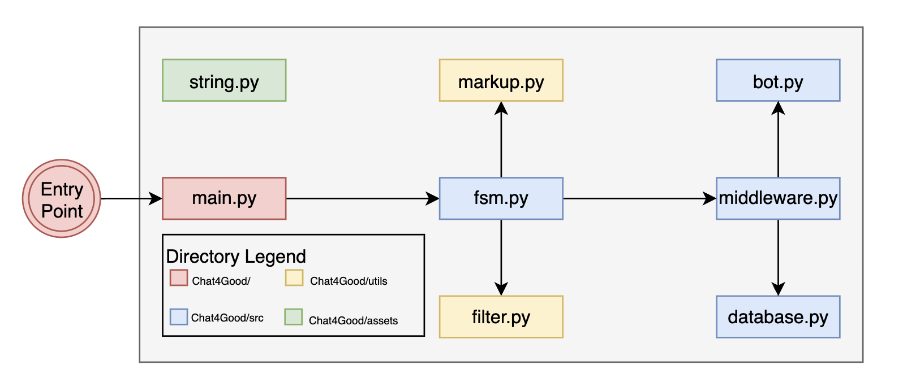

# Chat4Good

<p align="center">
A Create4Good Innovation Fund prototype</br>

</p>

## Developer guide
- This is the overview of the current architecture:
  
  - Our entry point is [main.py](main.py) located at the root directory
  - [assets](assets) directory contains:
    - [string.py](assets/string.py): define our string styling for our bot UI
    - and other images
  - [utils](utils) directory contains:
    - [filter.py](utils/filter.py): define custom filter (to be used in `fsm.py`)
    - [markup.py](utils/markup.py): define keyboard markup (to be used in `fsm.py`)
  - [src](src) directory contains:
    - [bot.py](src/bot.py): define our Telegram bot using API Token created from @BotFather (to be used in `middleware.py`)
    - [database.py](src/database.py): define MongoDB connection to store validation statistics for our bot (to be used in `middleware.py`)
    - [middleware.py](src/middleware.py): define middleware to help collect validation statistics (to be used in `fsm.py`)
    - [fsm.py](src/fsm.py): define a Finite State Machine for our bot guided questionnaire (to be used in `main.py`)
- First, you need to set up the following environment variable:
  - `TELEBOT_API_TOKEN` inside [bot.py](src/bot.py): talk to [@BotFather](https://core.telegram.org/bots#botfather)
and create your own bot
  - `MONGO_USERNAME`, `MONGO_PASSWORD`, `MONGO_URL` inside [database.py](src/database.py): 
    - create a Mongo Atlas account ([can sign in with GitHub](https://account.mongodb.com/account/login?nds=true)
    - create a Database with User follow the [QuickStart guide](https://www.mongodb.com/docs/atlas/getting-started/), 
make sure you whitelist your IP address. 
- Now, you can proceed to rum the bot:
```shell
cd Chat4Good/
# Create a python virtual environment
python -m venv env

# Activate virtual environment
source env/bin/activate

# Install dependency
pip install -r requirements.txt

# Run our bot
python main.py
```
- Lastly, if you want to contribute to this repo, try to make meaningful commit messages with [gitmoji](https://gitmoji.dev/)
## Resources:
- [pyTelegramBotAPI GitHub](https://github.com/eternnoir/pyTelegramBotAPI)
- [pyTelegramBotAPI code snippets/examples](https://github.com/eternnoir/pyTelegramBotAPI/tree/master/examples)
- [@BotFather](https://core.telegram.org/bots#botfather)
- [MonggoDB Getting Started](https://www.mongodb.com/docs/atlas/getting-started/)

## Acknowledgement
- [JD Lee](https://www.linkedin.com/in/jrande/): Mentor
- [Timothy Wee](https://www.linkedin.com/in/timothy-wee/): Business Dev + Team Lead
- [Joel Tay](https://www.linkedin.com/in/joel-tay-wh/) - Fullstack 
- [Dylan R.](https://www.linkedin.com/in/dylanraharja/) - Cybersecurity Specialist
- [Jodi Wu](https://www.linkedin.com/in/jodiwu/): UX/UI/Product Design
- [Tran Nguyen Bao Long](https://www.linkedin.com/in/tnbl265/): DevOps